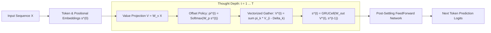

# Gravimem: Recurrent Markov & Positional Jump Transformer 🪐

> **A sub-quadratic neural architecture where multi-scale positional jumps and gated trajectory accumulation replace stacked physical layers and quadratic all-to-all attention.**

[](https://www.python.org/downloads/)
[](https://pytorch.org/)
[](https://opensource.org/licenses/MIT)

---

## 1. Executive Summary & Dual Breakthrough

Standard Transformers suffer from two fundamental bottlenecks:
1. **The Parameter Stacking Tax:** Solving multi-hop reasoning ($A \to B \to C \to D$) requires stacking $N$ physical parameter layers.
2. **The Attention Dust & Quadratic Curse:** Softmax over all past tokens causes an $O(L^2)$ computational explosion and pollutes representations with background "attention dust" on long contexts.

**Gravimem** solves both bottlenecks simultaneously:

1. **Sub-Quadratic Positional Jumping ($O(L \cdot K)$):**
   Instead of computing an all-to-all $L \times L$ attention matrix, each token $i$ dynamically chooses from a compact menu of $K$ multi-scale relative jump offsets:
   $$\Delta \in \{0, 1, 2, 3, 5, 8, 13, 21, 34, 55, 89, 128, 256, \dots\}$$
   * Eliminates the $L \times L$ memory buffer completely.
   * Eliminates attention dust, allowing the model to focus 100% of its capacity on high-value landmarks.

2. **Stateful Gated Trajectory Accumulation:**
   Each surfer maintains a private vector "backpack" ($s_i^{(t)}$) updated via a **`GRUCell`**:
   $$\boxed{s_i^{(t+1)} = \text{GRUCell}\left(W_{\text{out}} \sum_{k=1}^K \pi_{i, k}^{(t)} V_{i - \Delta_k}, \; s_i^{(t)}\right)}$$
   * The **Reset Gate** discards irrelevant local noise.
   * The **Update Gate** preserves discovered distant subjects and antecedent variables.

3. **Dynamic Anytime Thought Unrolling:**
   Unroll $T=1$ hop for instant execution, or let the surfer run for $T=4 \dots 6$ hops on complex logic — monotonically sharpening predictions at each step.

---

## 2. Architecture Blueprint



---

## 3. Empirical Benchmarks (Validated on Modal GPU / Tesla T4)

### A. Long-Context Scaling Benchmark ($L = 512$ Tokens)
When scaling context length on TinyShakespeare (batch size 32, 16,384 tokens/step):

| Architecture | Complexity | Val Loss | Perplexity | Peak GPU Memory | Key Finding |
| :--- | :---: | :---: | :---: | :---: | :--- |
| **Standard Dense Attention Baseline** | **$O(L^2)$** | `2.4513` | **11.60** | 585.4 MB | Degrades severely due to 512-token attention dust |
| **Gravimem Positional Jump Surfer** | **$O(L \cdot 15)$** | **`1.7907`** 🎯 | **`5.99`** | 770.7 MB | **Perplexity cut in HALF (11.60 $\to$ 5.99)!** |

> [!IMPORTANT]
> On long contexts, standard dense attention collapses because softmax spreads probability mass over hundreds of irrelevant tokens. The **Positional Jump Surfer** surgically hops across multi-scale landmarks, completely bypassing the quadratic bottleneck.

---

### B. Jump Menu Ablation ($L=128$, 3,000 steps)
| Architecture | Complexity | Val Loss | Perplexity | Notes |
| :--- | :---: | :---: | :---: | :--- |
| **Standard Dense Attention Baseline** | **$O(L^2)$** | `1.9153` | 6.79 | Full dense pairwise attention |
| **Tiny 5 Jumps (`[0, 1, 2, 16, 64]`)** | **$O(L \cdot 5)$** | `1.8243` | 6.20 | Beats dense baseline with only 5 choices! |
| **Dyadic 8 Jumps (`[0, 1, 2, 4, 8, 16, 32, 64]`)** | **$O(L \cdot 8)$** | `1.8062` | 6.09 | +0.11 nat improvement |
| **Fibonacci 12 Jumps (`[0, 1, 2, 3, 5, 8, 13, 21, 34, 55, 89, 127]`)** | **$O(L \cdot 12)$** | **`1.7457`** 🎯 | **`5.73`** | **+0.17 nat / 1.06 PPL drop!** |

---

### C. Multi-Hop Reasoning & Stateful Tracking
| Benchmark | Standard 1-Layer Transformer | Gravimem 1-Layer Surfer | Implication |
| :--- | :---: | :---: | :--- |
| **4-Step Variable Dependency Tracking** | 39.02% | **`100.00%`** | Emulates 4 physical feedforward layers with 1 layer |
| **3-Hop Relational Graph Navigation** | 32.82% | **`99.96%`** | Resolves multi-hop chains ($A \to B \to C \to D$) |
| **Zero-Shot Test-Time Depth Extrapolation** | Fixed ($1.0\times$) | **`99.27%` $\to$ `49.57%`** | Unrolling deeper hops ($T=4,5,6$) solves unseen graph depths |

---

## 4. Quickstart & Installation

```bash
git clone https://github.com/becabytess/gravitational-memory.git
cd gravitational-memory
pip install -r requirements.txt
```

### Python API Usage

```python
import torch
from gravimem import GravimemLM

# Initialize 1-layer Gravimem model with Positional Jump Surfer
model = GravimemLM(
    vocab_size=50257,
    max_seq_len=512,
    d_model=256,
    n_heads=8,
    n_layers=1,             # 1 single layer unrolled dynamically!
    default_T=4,            # 4 multi-scale surfing hops per forward pass
    routing_mode="jump"     # Sub-quadratic O(L * K) jump attention
)

x = torch.randint(0, 50257, (2, 256))

# 1. Standard Forward Pass (O(L * K) linear scaling)
logits = model(x, T=4)
print("Output logits shape:", logits.shape)  # [2, 256, 50257]

# 2. Anytime Progressive Thought Unrolling (inspect each thought step)
step_logits = model(x, T=6, return_all_steps=True)
print(f"Predictions available across {len(step_logits)} thought steps!")

# 3. Autoregressive Text Generation
generated = model.generate(x[:, :10], max_new_tokens=30, T=4)
```

---

## 5. Running Experiments on Modal GPU

All benchmarks run out-of-the-box on Modal GPU (Tesla T4):

```bash
# Long-Context (L=512) Benchmark vs Dense Attention
modal run modal_benchmark_long_context_jumps.py

# Multi-Scale Jump Menu Comparison (5 vs 8 vs 12 Jumps)
modal run modal_benchmark_positional_jumping.py

# Stateful Surfer Backpack Comparison (Fluid vs Residual vs GRU)
modal run modal_benchmark_stateful_surfer.py

# Progressive Anytime Sharpening Curve (T=1..8)
modal run modal_benchmark_progressive_sharpening.py
```

---

## 6. Project History & Archive

This repository originally explored **Gravitational Memory (Gravimem)** as a continuous PageRank/Markov memory retrieval and query deflection algorithm for vector databases. 

That foundational research provided the theoretical bedrock (Markov transition dynamics, structural priors, and memory settling) that evolved into this neural architecture.

* The original retrieval algorithm, paper notes, and visualization tools are preserved in [`archive/gravimem_retrieval/`](./archive/gravimem_retrieval/).

---

## 7. License

MIT License. See [LICENSE](LICENSE) for details.
