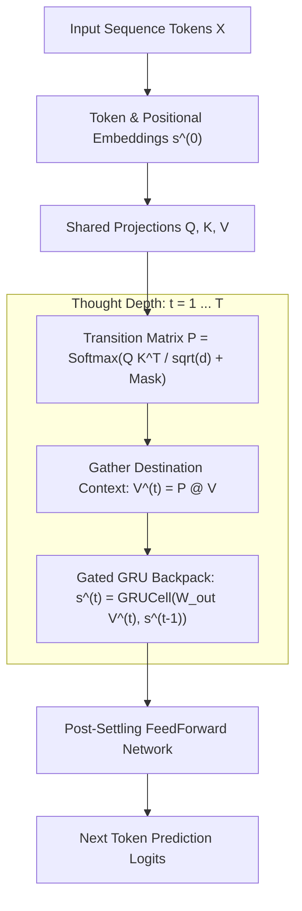

# Gravimem: Recurrent Markov Transformer with Gated Trajectory Surfing 🪐

> **A new paradigm in neural sequence modeling where iterative Markov surfing and gated trajectory accumulation replace stacked physical parameter layers.**

[](https://www.python.org/downloads/)
[](https://pytorch.org/)
[](https://opensource.org/licenses/MIT)

---

## 1. Overview & Core Intuition

Standard Transformers scale reasoning capacity by **stacking physical layers of parameters** ($L_1 \to L_2 \to L_3 \dots$). A single attention layer can only perform a direct 1-step lookup ($A \to B$), requiring $N$ physical parameter layers to resolve an $N$-hop dependency chain ($A \to B \to C \to D$).

**Gravimem** changes this fundamental paradigm:
Instead of stacking redundant weight matrices, Gravimem uses a **single shared projection layer** and unrolls **computational thought depth through recurrent Markov surfing**:

1. **Parallel Surfers:** We launch $L$ parallel surfers across the sequence (one starting at each token position).
2. **Transition Probability Graph ($P$):** Surfers observe a learned causal transition map $P_{ij} = \text{Softmax}(Q_i K_j^\top / \sqrt{d_k})$.
3. **Stateful Gated Backpack ($s_i^{(t)}$):** As each surfer hops along dependency chains, it updates a private hidden memory vector using a **`GRUCell`**:
   $$\boxed{s_i^{(t)} = \text{GRUCell}\left(W_{\text{out}} \sum_{j \le i} P_{ij} V_j, \; s_i^{(t-1)}\right)}$$
4. **Anytime Progressive Sharpening:** Computation can be stopped after 1 hop for instant execution, or unrolled for 4–6 hops on complex logic — monotonically sharpening predictions at every step.

```
Standard Attention:   s_new = s_old + (P @ V)        <-- Linear vector addition causes feature collision
Gravimem GRU Surfer:  s_new = GRUCell(P @ V, s_old)  <-- Gating selectively stores & forgets along path
```

---

## 2. Architecture Diagram



---

## 3. Key Empirical Discoveries & Benchmarks

All benchmarks were rigorously validated on **Modal GPU cloud infrastructure (Tesla T4)**:

### A. Memory Cell Comparison on TinyShakespeare LM (3,000 steps)
| Surfer Memory Mechanism | 4-Step Variable Tracking Accuracy | LM Validation Loss | Perplexity | Notes |
| :--- | :---: | :---: | :---: | :--- |
| **Pure Markov Fluid ($M \cdot V$)** | 100.00% | 2.0191 | 7.53 | Standard linear mixing baseline |
| **Residual Backpack ($s + V$)** | 100.00% | 2.0039 | 7.41 | Linear residual accumulation |
| **Gated MLP Backpack** | 100.00% | 1.9288 | 6.88 | Gated feedforward accumulation |
| **Gated GRU Backpack (`GRUCell`)** | **`100.00%`** | **`1.7458`** 🎯 | **`5.73`** | **+0.2733 nat improvement in 1 layer!** |

### B. Progressive Anytime Sharpening Curve ($T = 1 \dots 8$ Hops)
When trained with random depths $T \in [3, 6]$ and unrolled at inference time:
```
  Hops T = 1 : Val Loss = 1.8688 | Perplexity = 6.48  (Immediate 1-hop priority)
  Hops T = 2 : Val Loss = 1.8488 | Perplexity = 6.35  (Clause bridging)
  Hops T = 3 : Val Loss = 1.8452 | Perplexity = 6.33  (Global context)
  Hops T = 4 : Val Loss = 1.8439 | Perplexity = 6.32  (Refined confidence)
  Hops T = 5 : Val Loss = 1.8433 | Perplexity = 6.32  (Equilibrium)
  Hops T = 6 : Val Loss = 1.8430 | Perplexity = 6.32  (Stationary limit)
  Hops T = 7 : Val Loss = 1.8430 | Perplexity = 6.32  (Zero-Shot Extrapolation)
  Hops T = 8 : Val Loss = 1.8431 | Perplexity = 6.32  (Zero-Shot Extrapolation)
```
* **Strict Monotonicity:** Each additional hop steadily sharpens output confidence.
* **Zero-Shot Stability:** Does not diverge or oversmooth even when unrolled past training horizons.

### C. Sparse & Discrete Path Exploration
| Surfer Variant | TinyShakespeare LM Val Loss | Connectivity / Sparsity |
| :--- | :---: | :--- |
| **Dense Soft Attention** | **`2.2913`** | Full $O(L^2)$ matrix attention |
| **Top-4 Sparse Surfer ($k=4$ per hop)** | **`2.3454`** | **97.7% of full dense performance with only 4 tokens/hop!** |
| **Top-2 Sparse Surfer ($k=2$ per hop)** | 2.4481 | $2 \times L$ sparse connections |
| **Hard Top-1 Discrete Surfer (STE)** | 2.4913 | 1 discrete token path per step ($1 \times L$) |

---

## 4. Quickstart & Installation

```bash
git clone https://github.com/becabytess/gravitational-memory.git
cd gravitational-memory
pip install -r requirements.txt
```

### Python API Usage

```python
import torch
from gravimem import GravimemLM

# Initialize 1-layer Gravimem model with Gated Surfer Backpack
model = GravimemLM(
    vocab_size=50257,
    max_seq_len=512,
    d_model=256,
    n_heads=8,
    n_layers=1,       # 1 layer unrolled dynamically!
    default_T=3       # 3 surfing hops per forward pass
)

x = torch.randint(0, 50257, (2, 64))

# Standard forward pass (T=3 hops)
logits = model(x, T=3)
print("Output logits:", logits.shape)  # [2, 64, 50257]

# Anytime Progressive Forward Pass (get predictions at each thought step)
step_logits = model(x, T=5, return_all_steps=True)
print(f"Logits available across {len(step_logits)} thought steps!")

# Autoregressive text generation
generated = model.generate(x[:, :10], max_new_tokens=20, T=4)
```

---

## 5. Running Experiments on Modal GPU

All benchmarks are pre-configured to run out-of-the-box on Modal GPU:

```bash
# Run the Stateful Surfer Backpack comparison
modal run modal_benchmark_stateful_surfer.py

# Run the Progressive Anytime Sharpening evaluation
modal run modal_benchmark_progressive_sharpening.py

# Run the Sparse & Discrete Path Surfing suite
modal run modal_benchmark_sparse_surfing.py

# Run Qualitative Attention Mass Flow analysis
modal run modal_gravimem_qualitative_analysis.py
```

---

## 6. Project History & Archive

This repository originally explored **Gravitational Memory (Gravimem)** as a continuous Markov/PageRank memory retrieval and query deflection algorithm for vector databases. 

That foundational research provided the theoretical bedrock (Markov transition matrices, structural prior settling, and teleportation priors) that evolved into this neural architecture.

* The original retrieval algorithm, paper notes, and visualization tools are preserved in [`archive/gravimem_retrieval/`](./archive/gravimem_retrieval/).

---

## 7. License

MIT License. See [LICENSE](LICENSE) for details.
